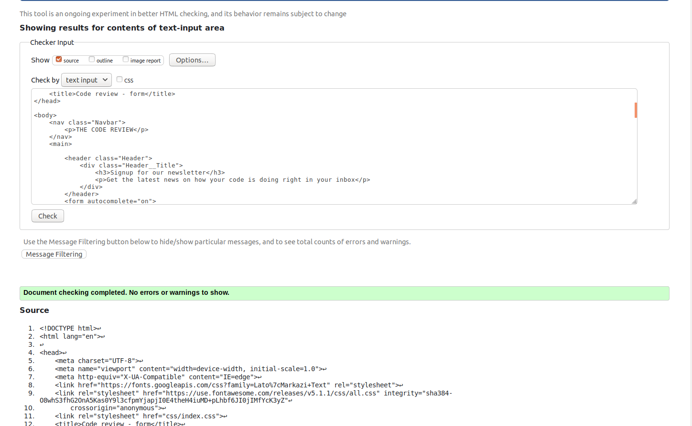

# Third project for the 20h talent ikigai bootcamp
#[DEMO](https://ranacode.github.io/20h-talent-ikigai-project3/)
## Goal
Have a first contact with the HTML5 forms as well as their layout and style application having in mind a responsive approach.

### Tools and concepts using in this project:
  ***I didn't need media queries to perform the responsive design.***
- Visual Studio Code
- BEM Methodology to write CSS rules
- Semantic HTML5
- W3C validator

### W3C validation

